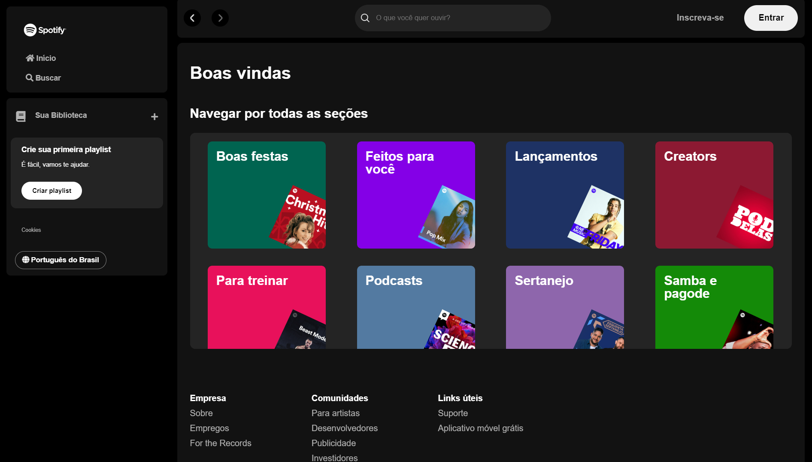

# Spotify clone

Spotify clone is a project developed by me (Fabio) with the help of Alura, one of the biggest dev schools of Brazil.

## ✔️ Techniques and technologies used:

This site used the following technologies:

- `HTML` - Markup language
- `CSS` - Stylesheet language
- `JavaScript` - Mainly programming language

## 🔨 Project features:

In this developement stage, this website has the followings features:

- Looks like with the truely website rsrs
- Search songs (only some singers and musics are in the project API)
